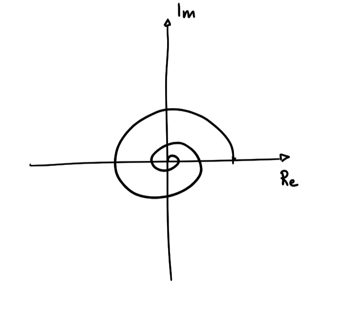

# NUMERI COMPLESSI
$$z=x+jy$$
$$Re[z]=x\qquad Im[z]=y$$
$$e^z=1+z\frac{z^2}{2}+\frac{z^3}{3!}+~...$$
$$e^z=e^xe^{jy}$$
$e^x$ rappresenta la distanza dal centro, $e^{jy}$ rappresenta la rotazione compiuta ($y$ radianti).

In questo esempio, $e^x$ rappresenta l'ampiezza della spirale che quindi è decrescente: $x$ dipende dal tempo in maniera decrescente ($x=-2t$); $e^{jy}$ rappresenta la velocità di rotazione del segnale.

Prendendo la parte reale o immaginaria di questo segnale complesso si otterrebbero le proiezioni del segnale sugli assi, ottenendo quindi seno e coseno che decrescono nel tempo.