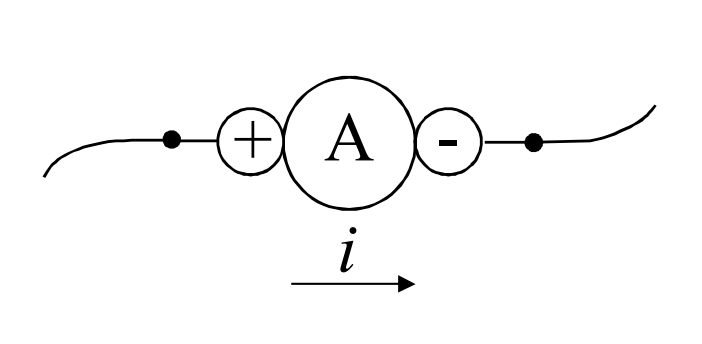
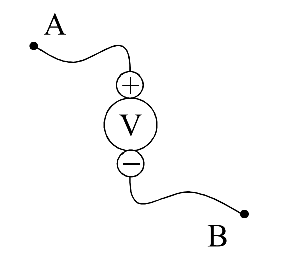
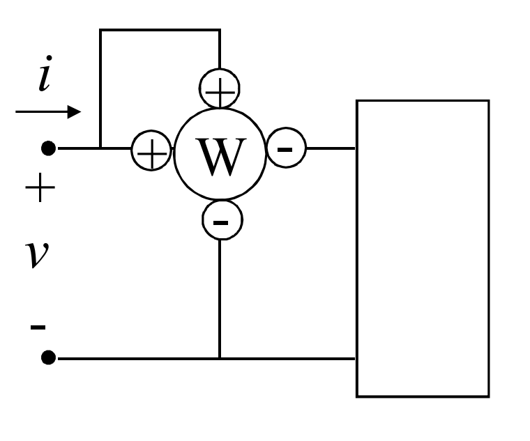

# AMPEROMETRO
Strumento che dato un conduttore filiforme, ne misura la corrente che lo attraversa.

Ha due morsetti, $+$ e $-$ .

### AMPEROMETRO IDEALE
- non modifica il circuito
- comunica in tempo reale il valore della corrente

# VOLTMETRO
Strumento che misura la tensione presente tra due capi di un conduttore filiforme.

Ha due morsetti, $+$ e $-$ .

### VOLTMETRO IDEALE
- non modifica il circuito
- comunica in tempo reale il valore della tensione

# WATTMETRO
Strumento che misura la potenza scambiata ad una porta.

E' dotato di due coppie di morsetti: ==morsetti amperometrici== e ==morsetti voltmetrici==.

Ogni coppia di morsetti è contrassegnata dai segni $+$ e $-$.

Attraverso i morsetti amperometrici si fa fluire la corrente della porta, mentre ai morsetti voltmetrici fanno capo due conduttori filiformi che terminano sui due terminali della porta.

### WATTMETRO IDEALE
- non modifica il circuito
- comunica in tempo reale il valore della potenza scambiata