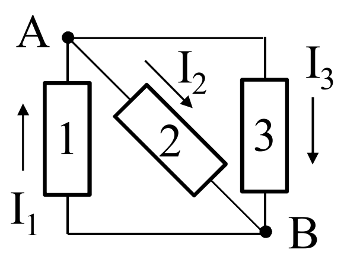
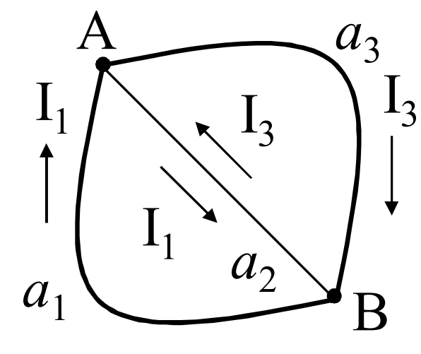
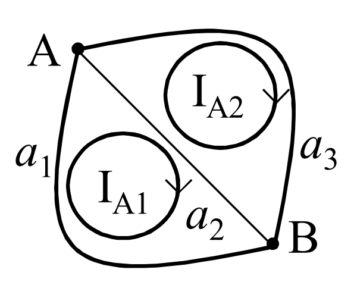

## ANALISI CON CORRENTI DI ANELLO
Si consideri una rete formata da 3 bipoli, avente un piano connesso.

Il grafo ha due anelli.
Si considerano le correnti sui tre bipoli, vale che $I_2=I_1-I_3$

Si può rappresentare la corrente $I_2$ con due correnti, una di valore $I_1$ e una di valore $I_3$

Si suggerisce quindi di introdurre le correnti di anello $I_{A1}$ e $I_{A2}$

$$I_1=I_{A1}\qquad I_3=I_{A2}\qquad I_2=I_{A1}-I_{A2}$$
Consideriamo il caso generico:
Per ciascuna corrente della rete vale che:
- nel caso di lato in comune fra due anelli adiacenti, $I_h$ è la differenza delle due correnti di anello che passano su quel lato
$$I_h=\pm(I_{Ar}-I_{As})$$
- nel caso di lato non in comune fra due anelli adiacenti, $I_h$ è la corrente di anelo che passa su quel lato
$$I_h=\pm I_Ar$$
Ciascuna corrente di anello soddisfa le LKC.

Si prenda una rete di GLT (o casi particolari) con grafo piano connesso.
Nel caso ci fossero GLC, si calcoli l'equivalente GLT.
Si tratta di una rete lineare:
$$
\begin{equation}
\begin{cases}
	\sum_{maglia}{\pm V}=0\qquad(m=l-n+1\quad LKT)\\\\
	\sum_{insieme~di~taglio}{\pm I}=0\qquad(n-1\quad LKC)\\\\
	V=E-RI\qquad (l~equazioni~dei~GLT)
\end{cases}
\end{equation}
$$

Si prendono correnti di anello orientate in modo concorde (tutte in senso orario o antiorario)
$$\sum_{maglia}{\pm E}=\sum_{maglia}{\pm R(\pm(I_{Ar}-I_{As}))}$$
Riordinando la scrittura si ottiene:
$$R_{A_{kk}}I_{A_k}-\sum_{h\neq k}{R_{A_kh}}I_{A_h}=E_{A_k}$$
- $R_{A_k}$ è la somma delle resistenze dei lati dell'anello $k$ (==autoresistenza di anello==)
- $R_{A_kh}$ è la resistenza del lato comune agli anelli $k$ e $h$ (==mutua resistenza tra anelli==)
- $E_{A_k}$ è la somma algebrica delle tensioni impresse dai GIT presenti sull'anello $k$ (==f.e.m. di anello==)

### LATO ANOMALO
Se nella rete è presente un lato costituito da un GIC senza in parallelo un resistore, tale lato è indicato come anomalo.
In questo caso si applica il metodo delle correnti di anello considerando come incognita supplementare la tensione $V_h$ del lato anomalo (del GIC).
La corrente $I_h$ del lato anomalo è pari a $J_h$:
$$I_h=J_h=\pm(I_{A_r}-I_{A_s})$$
Si ottiene un sistema di $m+1$ equazioni in $m+1$ incognite.