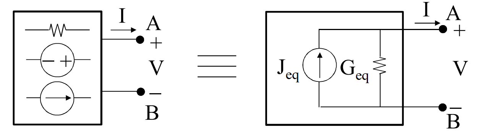

## TEOREMA DI NORTON
Si consideri una rete lineare come bipolo visto dai morsetti $A$ e $B$.
Se la rete è in grado di funzionare in cortocrcuito tra $A$ e $B$, essa equivale a un GLT di parametri $J_{eq}$ e $G_{eq}$.

$J_{eq}$ è pari alla corrente di cortocircuito ($I_{cc}$)  della rete alla porta $AB$.
Infatti vale la relazione $I=J_{eq}-G_{eq}V$, quindi per $V=0$ si ha che $I=J$.

In condizioni di rete a vuoto ($I=0$), la relazione del GLC fornisce la relazione $$V_0=\frac{J_{eq}}{G_{eq}}=\frac{I_{cc}}{G_{eq}}\qquad G_{eq}=\frac{I_{cc}}{V_0}=\frac{1}{R_{eq}}$$

Oppure, $G_{eq}$ è la conduttanza interna $G_i$ della rete lineare quando tutti i GIT  e GIC della rete sono azzerati.