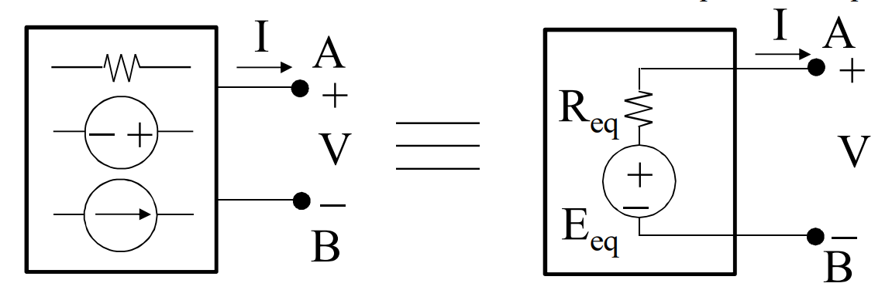

## TEOREMA DI THEVENIN
Si consideri una rete lineare come bipolo visto dai morsetti $A$ e $B$, se la rete è in grado di funzionare a vuoto tra i morestti, essa equivale ad un generatore lineare di tensione, di parametri $E_{eq}$ e $R_{eq}$.

$E_{eq}$ è pari alla tensione a vuoto della rete alla porta $AB$.
Per il GLT vale la relazione $V=E_{eq}-R_{eq}I$, per $I=0$ (ovvero a vuoto), la tensione è $V_0=E_{eq}$.

Si consideri ora la condizione di cortocircuito ($V=0$) alla porta $AB$.
Si scrive l'equazione del GLT:
$$V=E_{eq}-R_{eq}I$$
Si ottiene quindi:
$$I_{cc}=\frac{E_{eq}}{R_{eq}}\qquad(E_{eq}=V_0)\qquad R_{eq}=\frac{V_0}{I_{cc}}$$
Oppure si ha che $R_{eq}$ equivale alla resistenza interna $R_i$ quando tutti i GIT  e i GIC della rete lineare sono azzerati.