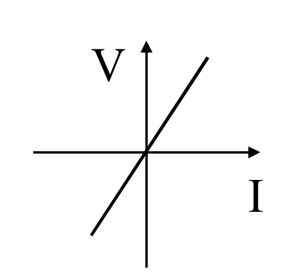
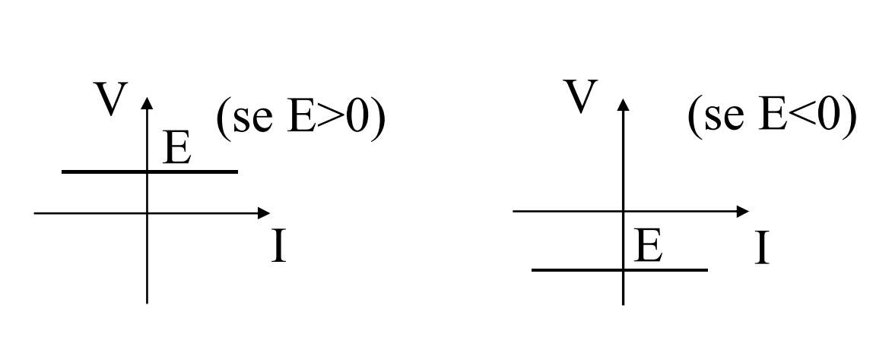
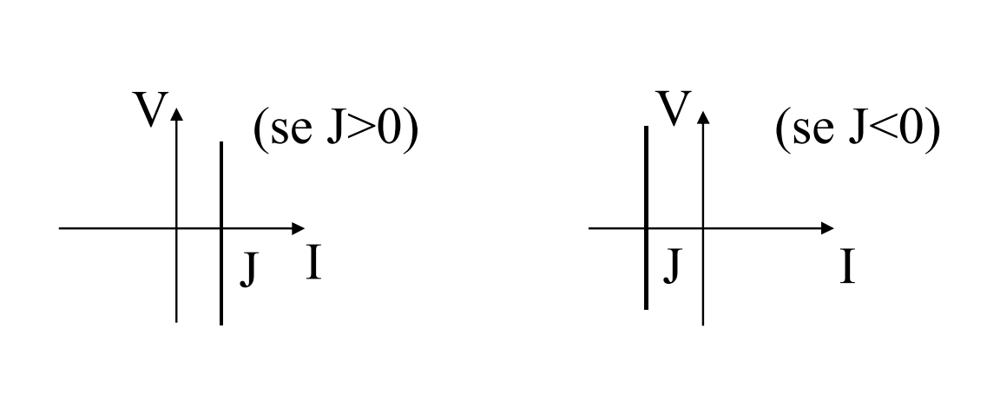
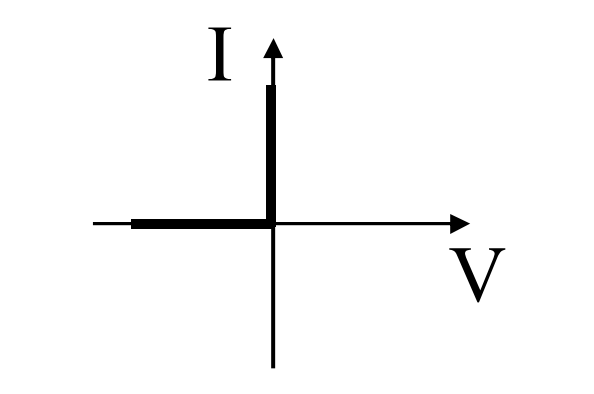

# CARATTERISTICA ESTERNA DI UN BIPOLO
Il comportamento elettrico di un [[Bipolo|bipolo]] è definito dalla relazione di legame che esso presenta fra tensione e corrente del bipolo.
Tale relazione è detta ==caratteristica esterna==

### RESISTORE IDEALE
[[Resistore_Ideale|{...}]]

$$V=RI$$

### GIT
[[Generatore_Ideale_Di_Tensione|{...}]]

$$V=E,\forall I$$

### GIC
[[Generatore_Ideale_Di_Corrente|{...}]]

$$I=J,\forall V$$

### DIODO IDEALE
[[Diodo|{...}]]

$$I=0~|~V\leq0\qquad V=0~|~\geq0$$