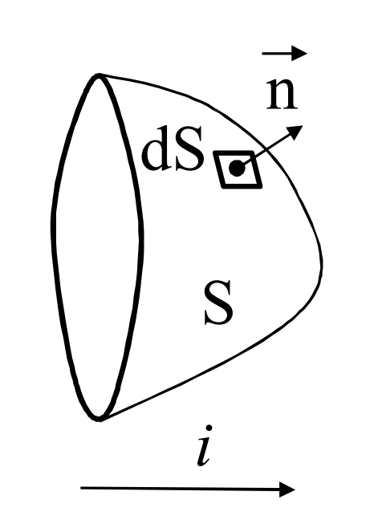
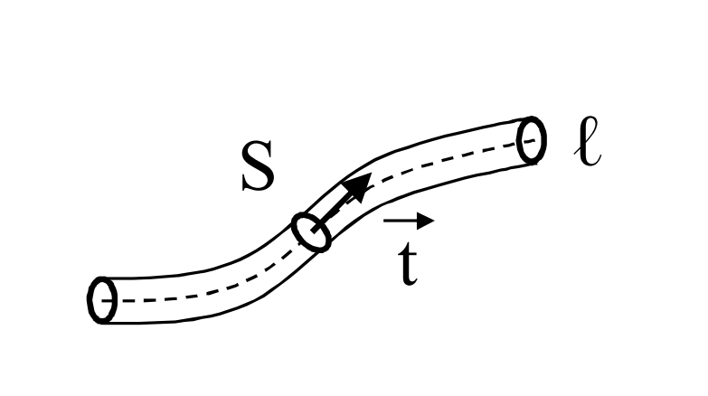

# CORRENTI ELETTRICHE
## CORRENTI DI CONDUZIONE
Avvengono nei conduttori metallici, in cui, accanto a elettroni strettamente legati ai rispettivi nuclei, ci sono anche elettroni liberi.

Gli elettroni liberisi muovono in modo disordinato nel metallo, ma sotto l'azione di un campo elettrico, prevale un modo ordinato nella direzione del campo, creando quindi una corrente in quella direzione.

## CORRENTI DI CONVEZIONE
Dovuto al modo del mezzo in cui sono presenti le cariche

----

Definiamo come intensità di corrente elettrica la grandezza scalare
$$i(t)~=~\frac{dq}{dt}$$

Il verso di riferimento della corrente sarà concorde con il versore $\vec{n}$.

Definiamo la ==densità di corrente elettrica==:
$$\vec{J}(P,t)~=~\rho_c^+~\vec{v}_{\rho}^+~+~\rho_c^-~\vec{v}_{\rho}^-$$
il quale è un campo vettoriale denominato ==campo di corrente==.

Osserviamo che può esistere un campo di corrente non nullo anche in un mezzo elettricamente neutro in tutti i suoi punti ($\vec{J}\neq~0~|~\rho_c~=~0$).

Come si può facilmente intuire, si ha la seguente relazione tra corrente e densità:
$$i(t)~=~\int_S{\vec{J}~\cdot~\vec{n}~dS}$$
ovvero la corrente à il flusso del vettore $\vec{J}$ attraverso la superficie orientata S a cui la corrente si riferisce.

## CORRENTE NEI CONDUTTORI FILIFORMI
$$i~=~\int_S{\vec{J}~\cdot~\vec{t}~dS}~=~\vec{J}~\cdot~\vec{t}~S~=~\pm JS$$

## CAMPO DI CORRENTE SOLENOIDALE
Consideriamo una regione di spazio S.
Il valore delle cariche uscenti $q_{usc}$ è opposto al valore delle cariche entranti $q_{int}$, quindi si ha che 
$$i_{usc}(t)~=~-\frac{dq_{int}(t)}{dt}$$
In un campo di corrente solenoidale, le grandezze sono costanti nel tempo, quindi si ha che $I_{usc}~=~0$.
