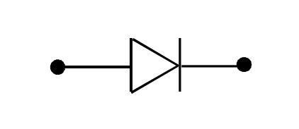

# DIODO
Il ==diodo a semiconduttore== è usualmente rappresentato con il seguente simbolo:

Il terminale di sinistra è detto ==anodo== mentre quello di destrea è detto ==catodo==

Si orienta la tensione dle diodo con il segno $+$ sull'anodo e con il segno $-$ sul catodo.

Applicando una tensione positiva si ha ==polarizzazione diretta==, la corrente con il riferimento indicato risulta positiva

Applicando una tensione negativa si ha ==polarizzazione inversa==, la corrente con il riferimento indicato risulta negativa

#### MATERIALE NECESSARIO PER IL CAPITOLO:
[[Bipolo]]