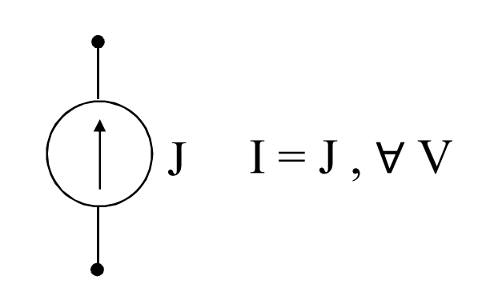
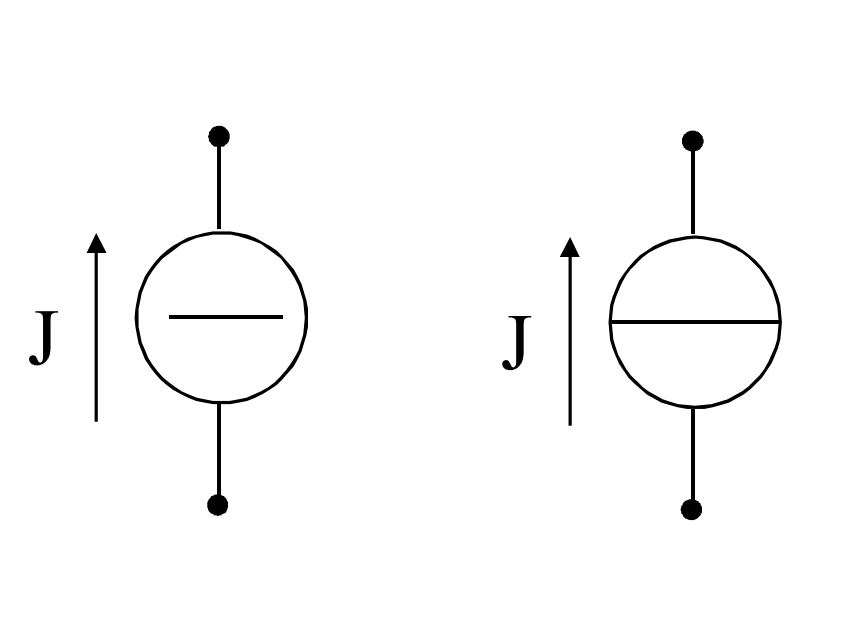

# GENERATORE IDEALE DI CORRENTE

Con riferimento al [[Generatore_Elettrico#COMPORTAMENTO A CARICO|generatore elettrico a carico]], si è ottenuto:
$$V=E-R_iI$$
ovvero $$I=\frac{E}{R_j}-\frac{V}{R_j}=J-G_iV$$
ponendo
$$J=\frac{E}{R_j}\qquad G_i=\frac{1}{R_j}$$

Un generatore elettrico a carico per il quale è $G_iV<<J$ è approssimabile con il generatore ideale di corrente in cui $I=J$.

A regime stazionario, si usano anche i simboli indicati di seguente:

#### MATERIALE NECESSARIO PER IL CAPITOLO:
[[Generatore_Elettrico]]