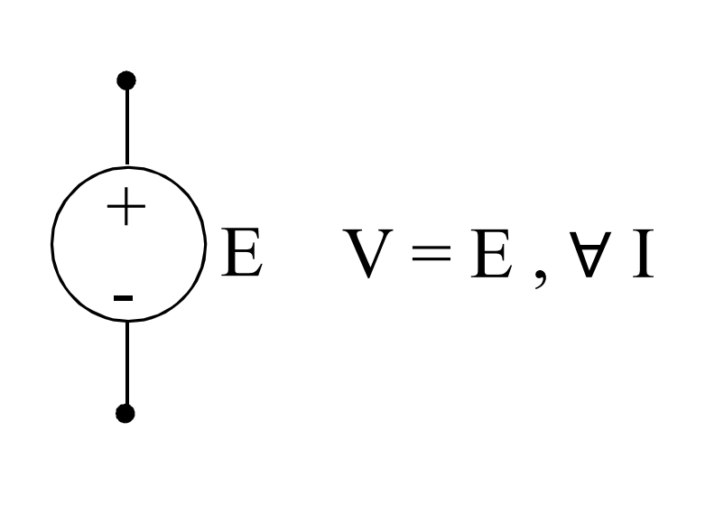
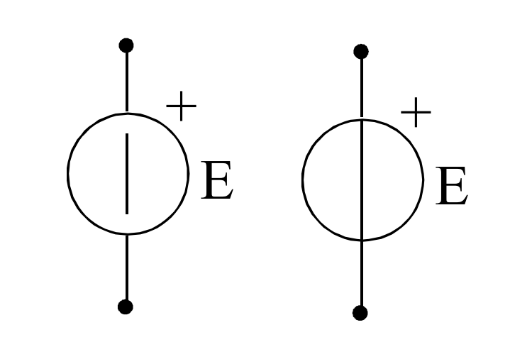

# GENERATORE IDEALE DI TENSIONE

Partendo dalla relazione del [[Generatore_Elettrico#COMPORTAMENTO A CARICO|generatore elettrico a carico]], se si considera il caso ideale di resistenza interna nulla, si può introdurre a regime stazionario il ==generatore ideale di tensione== (GIT).

Vale la relazione, a regime stazionario:
$$V=E$$
A regime stazionario, valgono anche i simboli indicati di seguito:

#### MATERIALE NECESSARIO PER IL CAPITOLO:
[[Generatore_Elettrico]]