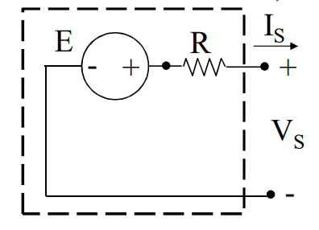

### GENERATORE LINEARE DI TENSIONE

Serie di un [[GIT|GIT]] e un [[Resistore_Ideale|resistore ideale passivo]].
Si ottiene un generatore lineare di tensione (GNT), in cui vale:
$$V_S=E-RI_S$$
Riconosciamo ora che un [[Generatore_Elettrico|generatore elettrico]] è un GLT

#### MATERIALE NECESSARIO PER IL CAPITOLO:
[[GIT]]
[[Resistore_Ideale]]
[[Serie_Di_Bipoli]]