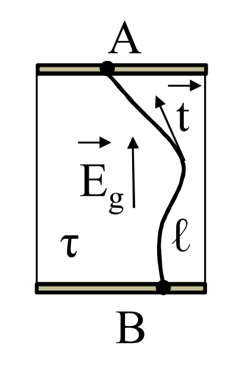
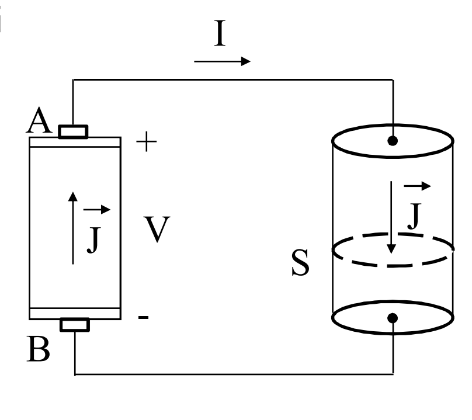

# GENERATORE ELETTRICO
Elemento facente parte di una [[Modello_Reti_Elettriche|rete elettrica]].

Abbiamo già introdotto alcune forze che generano una corrente elettrica.

Esistono tuttavia altri tipi di fenomeni che generano forze del genere, ad esempio fenomeni di natura ==chimica, termica, meccanica==, ecc... che agiscono sui supporti materiali delle cariche.

Un ==generatore elettrico== è una sede di interazioni tra i genomeni elettrici e di un'altra natura, che realizzano la ==generazione di energia elettrica== attraverso la ==conversione da altre forme di energia==.

Nei generatori elettrici sono, in generale, presenti delle forze non conservatice.

Per descrivere queste forze relative ai generatori elettrici, data la forze $\vec{F}_g$ che agisce sulla carica $q$, si introduce una ==forza elettrica specifica generatrice==:
$$\vec{E}_g=\frac{\vec{F}_g}{q}$$

## COMPORTAMENTO A VUOTO
Si consideri un generatore elettrochimico e lo si studia mediante una forza elettriga specifica generatrice $\vec{E}_g$.

Si ha per $\vec{E}_g$ una separazione di cariche, dando quindi origine a un campo $\vec{E}_c$ sia dentro che fuori il generatore.

A vuoto, cio' senza passaggio di corrente elettrica, dentro il generatore si ha:
$$\vec{E}_g+\vec{E}_c=0$$

## FORZA ELETTROMOTRICE
Viene definita la forza elettromotrice (f.e.m) l'integrale di linea della forza elettrica specifica generatrice $\vec{E}_g$:
$$E=\int_{B,l}^{A}{\vec{E}_g\cdot\vec{t}~dl}\qquad[E]=V$$

Per definizione, la forza elettromotrice tende a spingere le cariche positive da B ad A dentro il generatore.

Si tratta di un lavoro per unità di carica e si misura in volt.

Siccome all'equilibrio vale la relazione $\vec{E}_g+\vec{E}_c=0$, si ottiene allora:
$$E=\int_{B,l}^{A}{\vec{E}_g\cdot\vec{t}~dl}=-\int_{B,l}^{A}{\vec{E}_c\cdot\vec{t}~dl}=-V_{BA}=V_{AB}=V_0$$

La forza elettromotrice ==è pari alla ddp tra A e B== nella condizione di generatore elettrico a vuoto.

Si può considerare la fem come una ==proprietà del generatore==

##### FEM VARIABILE NEL TEMPO
$$e(t)=\int_{B,l}^{A}{\vec{E}_g\cdot{t}~dl}$$
## COMPORTAMENTO A CARICO

La tensione $V$ tra i morsetti $A$ e $B$ è differente dalla tensione a vuoto.

$V_0-V=E-V$ è proporzionale alla corrente I.
Si definisce resistenza interna $R_i$ del generatore il coefficiente di proporzionalità tra la differenza $V_0-V=E-V$ e la corrente $I$.
$$V=E-R_iI$$
