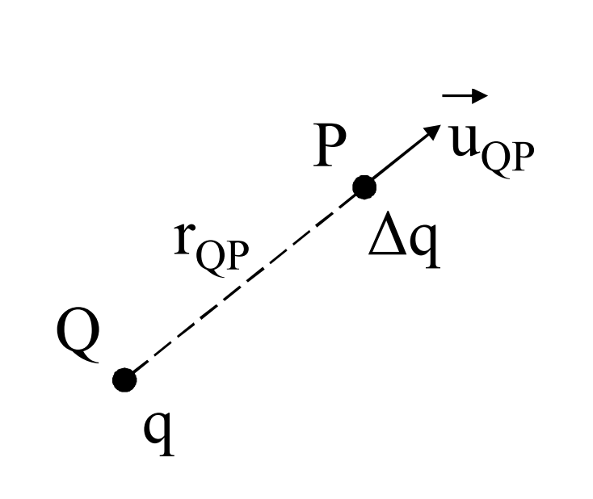

# LEGGE DI COULOMB
Due cariche elettriche puntiformi disposte in quiete nel buoto ad una distanza r, risentono ciascuna di una forza dovuta all'interazione tra le due cariche.
Tale forza è:
- diretta secondo la congiungente delle cariche
- attrattiva fra due cariche di segno opposto, repulsiva altrimenti
$$\Delta\vec{F}_c(P)~=~\frac{1}{4\pi\epsilon_0}~\frac{q\Delta q}{r^2_{QP}}~\vec{u}_{QP}$$

