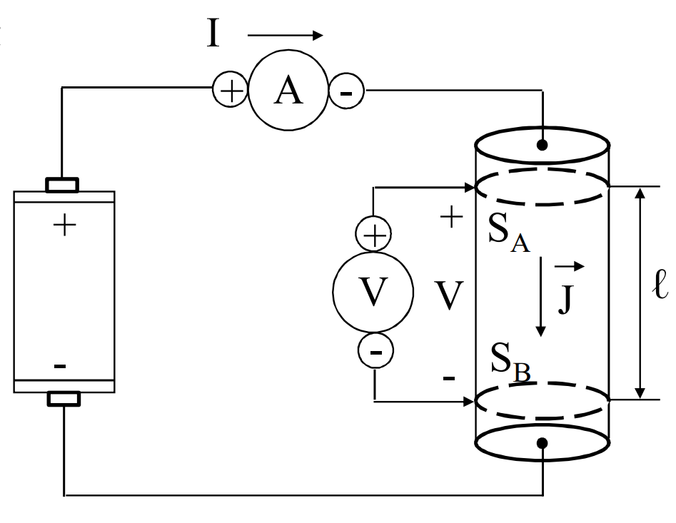

# LEGGE DI OHM
Si consideri un circuito elettrico realizzato mediante un generatore elettrico (es. pila) collegato ad un conduttore cilindrico uniforne, di sezione $S$.

Utilizzando un [[Amperometro,_Voltmetro_e_Wattmetro#AMPEROMETRO|amperometro]] e un [[Amperometro,_Voltmetro_e_Wattmetro#VOLTMETRO|voltmetro]] si misurano la corrente $I$ e la ddp $V$ tra $S_A$ e $S_B$, superfici parallele poste a distanza $l$.

Spostando il contatto del voltmetro sul bordo si $S_A$, la misurazione non varia (lo stesso vale per $S_B$).
$S_A$ e $S_B$ sono equipotenziali.

Cambiando il generatore elettrico, si trova una proporzionalità fra $V$ e $I$:
$$R~=~\frac{V}{I}\qquad[R]~=\ohm~=~\frac{V}{A}$$
detta ==resistenza elettrica==.

Definiamo come ==conduttanza elettrica==
$$G=\frac{1}{R}\qquad[G]=S=\ohm^{-1}$$
L'unità di misura è il Siemens.

Giocando con le formule si ottiene una formula inversa per la corrente:
$$I=\frac{V}{R}=GV$$

## RESISTIVITA' E CONDUCIBILITA'
La resistenza $R$ risulta proporzionale alla lunghezza $l$ e inversamente proporzionale alla sezione $S$.
Dipende inoltre da un parametro dipendente dal mezzo($\rho$):
$$R=\rho \frac{l}{S}=\frac{1}{\gamma}~\frac{l}{S}$$
$\rho$ è la ==resistività== e $\gamma$ è la ==conducibilità==.
$$[\rho]=\ohm m\qquad\gamma=\frac{1}{\rho}\qquad[\gamma]=\ohm^{-1}m^{-1}$$
