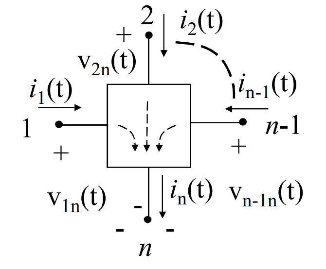

# M-BIPOLO
Un caso particolare di [[N-Poli|n-polo]], costituito solo da [[Porta_Elettrica|porte elettriche]].

Il numero di porte elettriche è indicato dalla $m$, avendo quindi $m$ correnti e $m$ tensioni di porta.

### N-POLO TRATTATO COME M-BIPOLO
Un n-polo può essere trattato come un m-bipolo con $m=n-1$.

Si sceglie un terminale di riferimento noto come ==terminale comune== (il morsetto corrispondente è detto morsetto comune).

Varrà quindi la relazione:
$$\sum_{k=0}^{n-1}{i_k(t)}~=~i_n(t)$$
Si può quindi considerare $i_n$ come il ritorno comune di tutte le correnti degli altri terminali: $n-1$ porte, ciascuna avente un morsetto costituito da uno dei primi $n-1$ morsetti e come altro morsetto, il morsetto comune.

  

Ad esempio, il transistor npn è un tripolo, che conviene considerare come un doppio bipolo:

### POTENZA ELETTRICA SCAMBIATA
La potenza scambiata è pari alla somma delle potenza scambiate alle m porte:
$$p(t)~=~\sum_{k=1}^m{p_k(t)}~=~\sum_{}$$