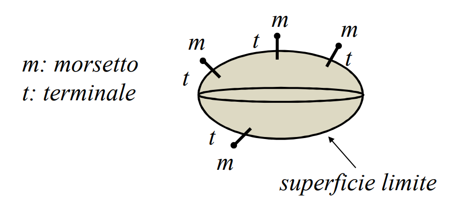
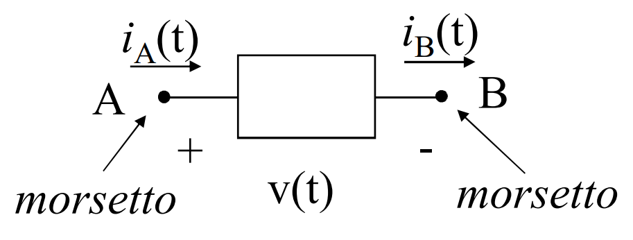
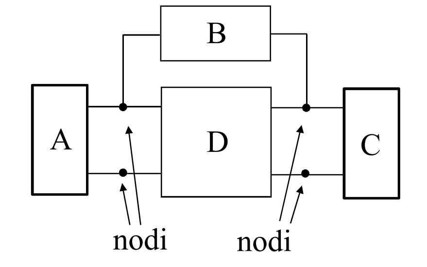

# MODELLO RETI ELETTRICHE

Le grandezze che vengono usate per studiare il comportamento del componente sono la ==corrente== e la ==tensione==.
A ciascun terminale è associata una corrente, e a ciascuna coppia di morsetti è associata una tensione.

Si considerano superfici in quiete e linee in quiete.

Ci troviamo in regime stazionario:
- il campo di corrente è [[Correnti_Elettriche#CAMPO DI CORRENTE SOLENOIDALE|solenoidale]]
- il campo elettrico è [[Campo_Elettrico#CAMPO ELETTROSTATICO|conservativo]]

Si ha quindi che la totale corrente (con riferimento) uscente dalla superficie limite del componente è nulla e che tutte le tensioni fra coppie di morsetti sono differenze di potenziale.

## SCHEMATIZZAZIONE DEI COMPONENTI

Ogni componente è rappresentato da una superficie chiusa, da cui emergono tratti filiformi, ciascuno dei quali ha per estremo un punto.

Se il componente ha 2 terminali, è detto ==bipolo==, se ne ha 3 ==tripolo==, con n terminali è detto [[N-Poli|n-polo]].

## RETI ELETTRICHE
I componenti elettrici sono collegati tra di loro, la ==rete elettrica è data dalla loro interconnessione==.

I ==morsetti in comune== in un nodo hanno tutti lo ==stesso potenziale==.

Ci sono due aspetti caratterizzanti la rete elettrica:
- tipologia (i tipi di componenti che costituiscono al rete)
- topologia (il modo con cui i componenti sono interconnessi)