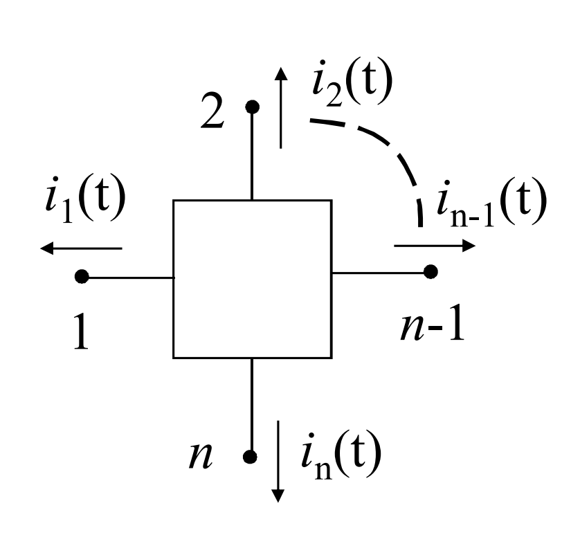

# N-POLI
#### PROPRIETA' FONDAMENTALI
- La somma delle correnti (con riferimento) uscenti è nulla in ogni istante $$\sum_{k=0}^n{~i_k(t)}~=~0$$
- La tensione fra una qualsiasi coppia di morsetti (o terminali) è una ddp

