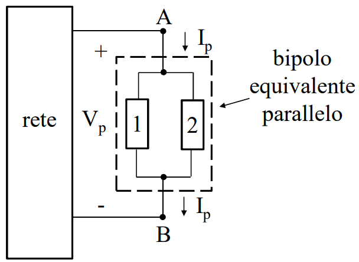

# BIPOLI IN PARALLELO
Due bipoli sono connessi in parallelo quando hanni i morsetti collegati alla stessa coppia di nodi.

Varranno le seguenti relazioni:
$$V_{eq}=V_h,\forall h$$
$$I_{eq}=\sum{I_h}$$
#### MATERIALE NECESSARIO PER IL CAPITOLO:
[[Bipolo]]
[[Modello_Reti_Elettriche]]
