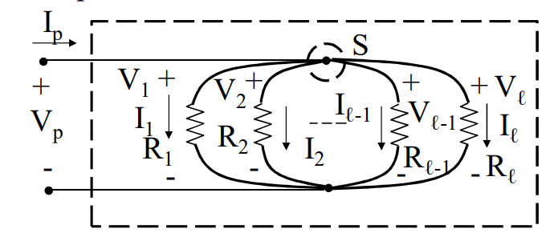

# BIPOLI IN PARALLELO
Due bipoli sono connessi in parallelo quando hanni i morsetti collegati alla stessa coppia di nodi.

Varranno le seguenti relazioni:
$$V_{eq}=V_h,\forall h$$
$$I_{eq}=\sum{I_h}$$

### RESISTORI IN PARALLELO

$$G_{eq}=\sum_{h=1}^{n}{G_h}$$
$$I_k=\frac{G_k}{\sum_{h=1}^{n}{G_h}}I_{eq}$$

$$$$
