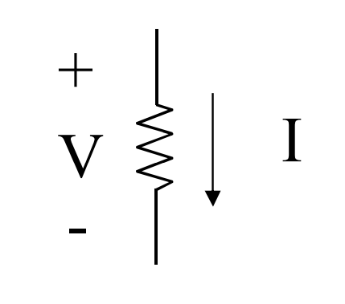

# RESISTORE IDEALE

Si tratta di un [[Bipolo|bipolo]] in cui vige la relazione tra tensione e corrente:
$$V=RI$$
Se $R>0$, si tratta di un ==resistore idale passivo== (è quanto introdotto con la [[Legge_di_Ohm|legge di Ohm]])
Se $R<0$ invece, si tratta di un ==resistore ideale attivo==.
Il caso $R=0$ è un caso limite di resistore ideale con resistenza nulla, in generale sarà trattato in modo specifico.

A seconda dei casi, la resistenza può essere indipendente o meno da tensione e corrente: si hanno rispettivamente ==resistori lineari e resistori non lineari==.