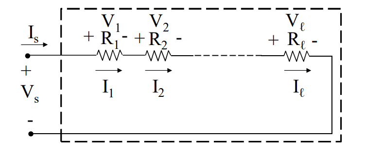

# RETI DI RESISTORI
Una rete formata da [[Resistore_Ideale|resistori ideali]] può essere approssimata ad un bipolo equivalente con la seguente relazione:
$$V=R_{eq}I$$
### RESISTORI IN SERIE

$$R_{eq}=\sum_{h=1}^{n}{R_h}$$
$$V_k=R_kI_{eq}=\frac{R_k}{\sum_{h=1}^{n}{R_h}}V_{eq}$$

### RESISTORI IN PARALLELO

$$G_{eq}=\sum_{h=1}^{n}{G_h}$$
$$I_k=\frac{G_k}{\sum_{h=1}^{n}{G_h}}I_{eq}$$
## TRIANGOLO E STELLA

Esistono reti di resistori che presentano collegamenti di tipo diverso rispetto alla serie e parallelo.

Consideriamo i seguenti tripoli di resistori, ==triangolo== e ==stella a tre vertici==.

Si può dimostrare che è possibile passare dalla stella a tre vertici all'equivalente triangolo e viceversa.
Il resto della rete quindi non si accorge della differenza una volta effettuata la sostituzione.

Se le resistenze usate per queste configurazioni sono uguali, allora vale la relazione $R_{\Delta}=3R_{stella}$ 

#### MATERIALE NECESSARIO PER IL CAPITOLO:
[[Resistore_Ideale]]
[[Serie_Di_Bipoli]]
[[Parallelo_Di_Bipoli]]