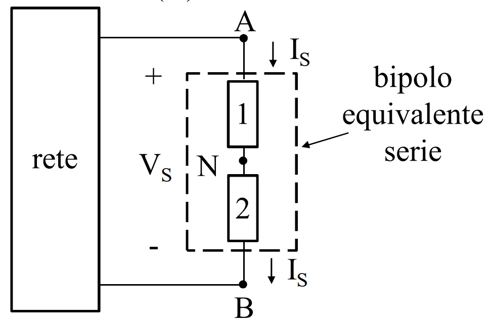
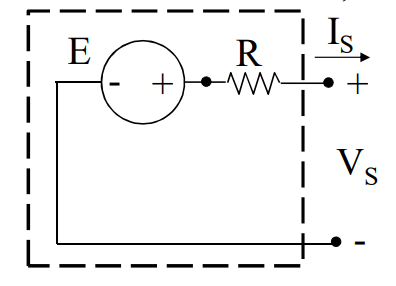
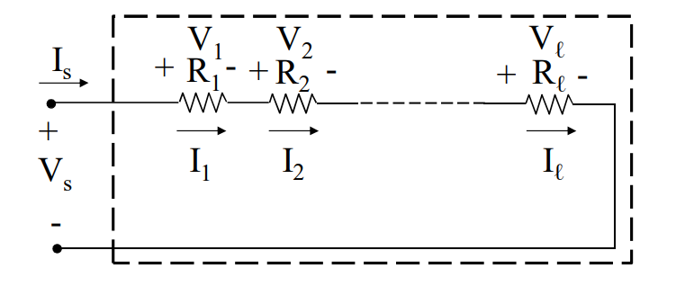

# BIPOLI IN SERIE
Due bipoli si dicono connessi in serie quando hanno un morsetto in comune, ovvero collegato allo stesso nodo e a tale nodo non è collegato alcun altro componente.

Si può pensare che al posto dei bipoli $1$ e $2$ ci sia un bipolo equivalente, che sostituendolo ai due bipoli non modifichi il circuito.

Varranno le seguenti relazioni:
$$V_{eq}=\sum{V_h}$$
$$I_{eq}=I_h,\forall h$$
### GENERATORE LINEARE DI TENSIONE

Serie di un [[Generatore_Ideale_Di_Tensione|GIT]] e un [[Resistore_Ideale|resistore ideale passivo]].
Si ottiene un generatore lineare di tensione (GNT), in cui vale:
$$V_S=E-RI_S$$
Si riconosce ora che questa è l'equazione del [[Generatore_Elettrico#COMPORTAMENTO A CARICO|generatore elettrico]].

### RESISTORI IN SERIE

$$R_{eq}=\sum_{h=1}^{n}{R_h}$$
$$V_k=R_kI_{eq}=\frac{R_k}{\sum_{h=1}^{n}{R_h}}V_{eq}$$