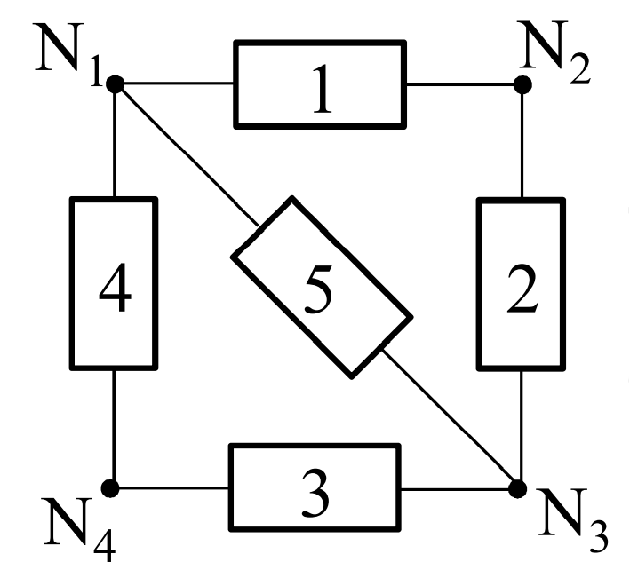
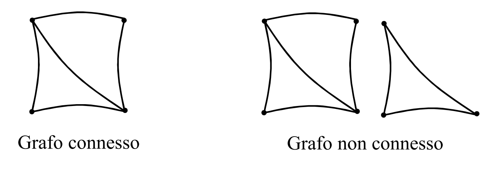
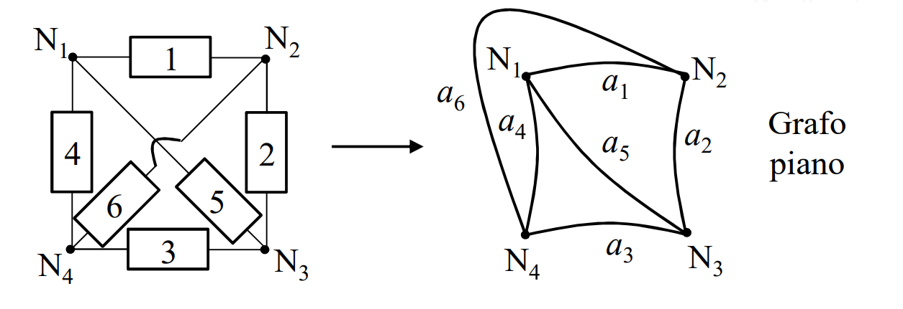
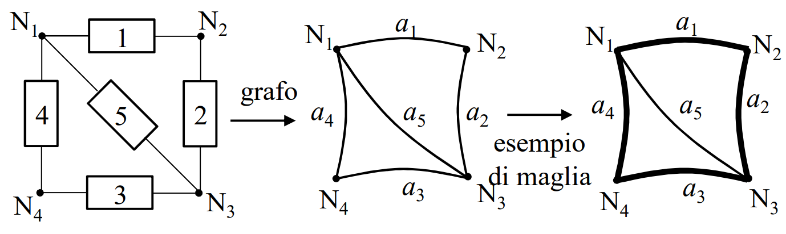
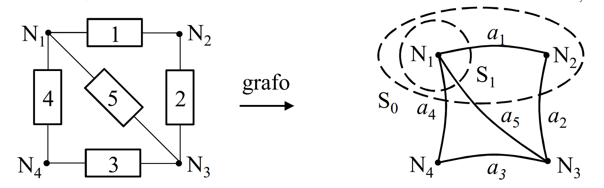
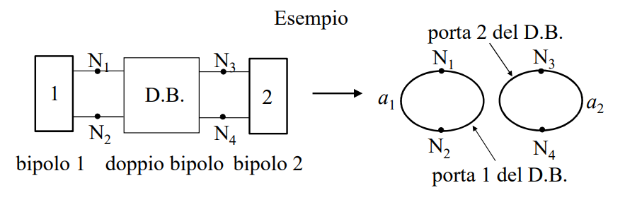

# TOPOLOGIA
Modo con cui gli [[N-Poli|n-poli]] sono interconnesi fra di loro, a prescindere dalla loro tipologia.

## GRAFO
La topologia di una rete viene tradizionalmente descritta mediante un tracciato grafico.

Un grafo è un insieme di pundi (detti nodi del grafo) e un insieme di segmenti (detti lati del grafo) che collegano ciascuna coppia di nodi.

Nel tracciare il grafo non è importante la lunghezza dei lati o la posizione dei nodi; l'importante è la rappresentazione delle interconnessioni tra i bipoli.

### GRAFO CONNESSO
Un grafo si dice connesso quando, dati due nodi, si puà sempre passare dall'uno all'altro, muovendosi lungo i suoi lati.

### GRAFO PIANO
Un grafo è detto piano se può essere disegnato su un piano senza che i lati si incrocino.

## MAGLIA
La maglia è una parte del grafo, tale da costituire nel grafo un percorso chiuso che tocca ciascun nodo una sola volta.

## ANELLO
Si definisce anello una maglia che orla una superficie, che sta sul piano, non contenente elementi del grafo

____

Si dimostra che per un grafo piano connesso piano, vale la relazione:$$m=l-n+1$$con m numero di anelli, l numero di lati, n numero di nodi

## INSIEME DI TAGLIO
Un insieme di taglio è un insieme di lati che sono tagliati dalla superficie chiusa che contorna un volume arbitrario che include uno o più nodi del grafo.

## ALBERO
L'albero è costituito da tutti i nodi del grafo e da un insieme di lati del grafo che collegano tali nodi, in modo che l'albero resti connesso ma senza formare maglie.

In un grafo possono esistere più alberi.

L'albero avrà un numero di lati pari a $l_a=n-1$, con n numero di nodi.

### COALBERO
Il coalbero è l'insieme di lati complementari a un dato albero.

Ogni alberi ha il suo coalbero

Il coalbero avrà un numero di lati pari a $l_c=l-n+1$

## GRAFO DI UNA RETE DI N-POLI
Per formare il grafo di una rete di n-poli, bisogna posizionare un lato per ogni porta.
Il grafo ottenuto potrebbe non essere connesso.

#### MATERIALE NECESSARIO PER IL CAPITOLO:
[[Modello_Reti_Elettriche]]